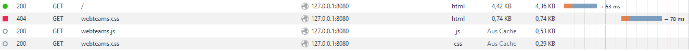
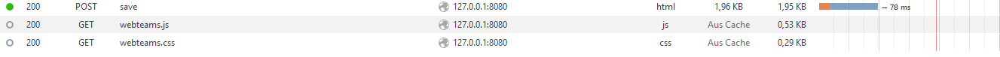

Dokumentation 1 Praktikumstermin 13.10.2016
David Krus, Mathis Rudolf

1. Aufbau der Webannwendung

Dateien und Verzeichnisstruktur:

* webteams
	- server.py
	- app
		+ __init__.py 	//Kennzeichnet Verzeichnis als Pythonpackage
		+ application.py	//Anwendungslogik
		+ database.py	//Datenbanklogik
		+ view.py		//Praesentation
			-__pycache
	- content
		+ form0.tpl	//Template für HTML
		+ form1.tpl	
		+ form2.tpl
		+ list0.tpl
		+ list1.tpl
		+ list2.tpl
		+ webteams.css	// Designvorschriften 
		+ webteams.js	// Javascript Funktionssammlung
	- data
		+ webteams.json	// Datenbank
	- doc
		+ a.mk
		+ b.html
		+ webteams.md	// Dokumentation
		
2.	Ergänzungen:

	- Erweiterung des Formulares in  form1.tpl.
	
	- Ergaenzung in den Funktionen createList_px und createForm_px aus der Datei view.py um die Semesterzahlen 
	beider Studenten. Sowie in den Funktionen getDefault_px und readData_p die Arrays um zwei leere stellen ergaenzt werden mussten.
	
	- Formular mit "Abbrechen" Button in form2.tpl eingefuegt.
	
	- Veraenderungen an Body und Table-Elementen mit Hilfe von CSS, ausgelagert in die Datei "webteams.css".
	
	- Ergaenzen der Funktion delete_px in der Datei "database.py" innerhalb der if-Verzweigung um die Zeilen:
		self.data_o[id_spl] = self.getDefault_px()
		self.saveData_p()
		status_b = True
		
	- Ergaenzung der Funktion confirmDelete_p in Datei webteams.js um die Zeilen:
		if(confirm("Are you sure?")){
            alert("deleted")
        }else{
            event_opl.preventDefault();
		}
		
3.	Beschreibung des HTTP Datenverkehrs
	
	- Start der anwendung:
		* 
		
	- Speichern:
		* 
		
		
		
		
		
		
		
		
		
		
		
		
		
		
		
	