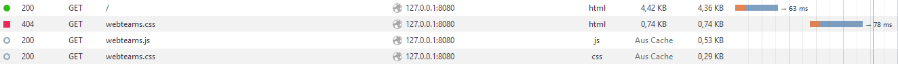

		Dokumentation für den zweiten Praktikumstermin von Mathis Rudolf und David Krus aus Gruppe D. Krefeld, den 16.11.2016.

		Ein Praxisphasenmanager der nach den Vogegebenen Kriterien erstellt wurde und die gewünschten Funktionen aufweist.
		Dieser wurde mit Python, Mako und Javascript realisiert. Als Datenbank dient eine JSONdatei.

		Diese Anwendung dient dazu die Auswahl von Praxisphasen für Studenten zu erleichern und sie einer gewünschten Praxisphase in einem gewünschten Betrieb zuzuweisen.

		 *Funktionsübersicht:
				+Erstellung von Studenten, Firmen, Lehrern und Praxisphasenangeboten.
				+Bearbeitung von Studenten, Firmen, Lehrern und Praxisphasenangeboten.
				+Löschen von Studenten, Firmen und Lehrern.
				+Sortierte Ausgabe der Praxisphasenangebote.

		application.py : Funktionen dieser Datei dienen zu Erstellung, Editierung und zum löschen der verschiedenen Komponenten, dies wird durch Verweise aud die database.py erreicht,
		wo die dortigen Funktionen dann die gewünschten Änderungen in der Datenbank vornehmen.

			Beispielfunktionen:
			Bsp. create Funktion : create...()
			Bsp. Editierfunktion : edit...()
			Bsp. Löschfunktion : delete...()

		database.py:
		Die Funktionen in database.py sind dafür zustäig Werte in die Jason Datei zu schreiben und zu löschen.
		Außerdem werden durch die dortigen Funktionen Werte aus der Tabelle gelesen.

		Beispielfunktionen
			Bsp. Lesen : def readStudent_px(self, id_spl):.
			Bsp. Schreiben: def saveData_p(self):.
			Bsp. Löschen : def deleteStudent_px(self, id_spl):.

		Die view.py dient zur Implementierung von Templates und als Markupgenerator.

			Bsp. Funktion Templateimplementierung :  def createStudentForm_px(self, id_spl, data_opl):.

				Hierbei wird das studentform0.tpl Template eingebunden und für das markup der Seite genutzt.

		Datenablage : 

			Als Datenablage nutzen wir eine JSONdatei, welche wir in Dictionaries und Listen unterteilt haben.
				
			
			
		Validierte Seiten:
			
			
			Validierte Studentenseite:
				
				

			Validierter CSScode:
				
					
					
					
					
			Validierte Indexseite:
				
					
					
			Validierte Lehrerseite:
				
					
					
			Validierte Auswertungsseite:
				