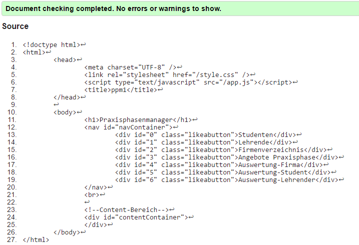

# Dokumentation für den dritten Praktikumstermin von Mathis Rudolf und David Krus aus Gruppe D. Krefeld, den 08.12.2016.

		Ein Clentbasierter Praxisphasenmanager der nach den Vogegebenen Kriterien erstellt wurde und die gewünschten Funktionen aufweist.
		Dieser wurde mit Python, Mako und Javascript realisiert. Als Datenbank dient eine JSONdatei.

		Diese Anwendung dient dazu die Auswahl von Praxisphasen für Studenten zu erleichern und sie einer gewünschten Praxisphase in einem gewünschten Betrieb zuzuweisen.
		Die Anwendung wurde nach den Vorgaben clientbasiert realisiert.
		 
* Funktionsübersicht:
	+ Erstellung von Studenten, Firmen, Lehrern und Praxisphasenangeboten.
	+ Bearbeitung von Studenten, Firmen, Lehrern und Praxisphasenangeboten.
	+ Löschen von Studenten, Firmen und Lehrern.
	+ Sortierte Ausgabe der Praxisphasenangebote.

		app.js : Funktionen dieser Datei dienen zur clientseitigen Funktionalität für das Kommunizieren mit dem Server,der Funktionalität für das Formular- und das Listen-Menü,
		löschen, erstellen und bearbeiten von Zeilen, die Navigation und zur Programm Initialisierung.

			Beispielfunktionen:
			Bsp. function SetContent(view)
			Bsp. function SetStatus(view)()
			Bsp. function GetFormData()
		
		
		view.js : Hier werden Funktionen zum fülen von Templates und dem erstellen von Formularen bereit gestellt.
			
			
		application.py : Dient zur Erstellung von Listen und Forms, Außerdem werden hier Reihen hinzugefügt, bearbeitet und gelöscht.

			Beispielfunktionen:
			Bsp. create Funktion : def addRow()
			Bsp. Editierfunktion : def updateRow()
			Bsp. Löschfunktion : def deleteRow()

		database.py:
		Die Funktionen in database.py sind dafür zustäig Werte in die Jason Datei zu schreiben und zu löschen.
		Außerdem werden durch die dortigen Funktionen Werte aus der Tabelle gelesen.

		Beispielfunktionen
			Bsp. Lesen : def readStudent_px(self, id_spl):.
			Bsp. Schreiben: def saveData_p(self):.
			Bsp. Löschen : def deleteStudent_px(self, id_spl):.

		Die view.py dient zur Implementierung von Templates und als Markupgenerator.

			Bsp. Funktion Templateimplementierung :  def CreateForm_px(self, data_o, option, ansicht, id_s):.
				
				
				
* Datenablage : 

			Als Datenablage nutzen wir eine JSONdatei, welche wir in Dictionaries und Listen unterteilt haben.

			
			
* Validierte Seiten:
					
					
					
					
					
			Validierter CSScode:

					
					
					
					
			Validierte Indexseite:

					
					
			Validierte view.js:

					
					
			Validierte app.js:
