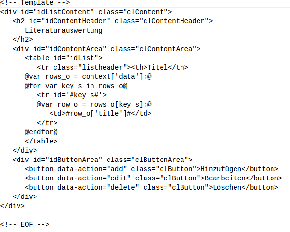
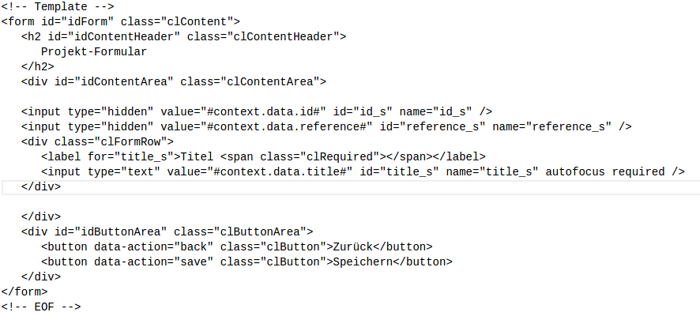

# WEB-Engeneering, Praktikum 4, Aufgabe: Bug-Tracker, Mathis Rudolf, 1018387

* ##1.0 Einleitung:
	Der Bug-Tracker ist eine Web-Applikation basierend auf dem REST-Ansatz und umgesetzt in Javascript und Python. Aufgabe dieser Applikation ist das Speichern und Verarbeiten von Bug-Informationen. Zu diesem Zweck werden verschiedene Datensätze, die in Relation zu Bugs stehen, ebenfalls Verwaltet. Der Anwender kann Fehler protokollieren, Entwickler den Fehler zuweisen und Lösungen protokollieren und freigeben.

* ##2.0 Implementierung des Servers:
	+ ###2.1 REST:
		Der Server muss in der REST-Architektur einheitliche Schnittstellen bieten. Die Nachrichten müssen selbstbeschreibend sein. In diesem fall sind die durch die Standard-Methoden umgesetzt, die auf jeden Datenbestand anwendbar sind. Das Server-System ist mehrschichtig, wobei nur die Standard-Methoden "Exposed" sind. Der Server verwaltet keine Zustände.
	
	+ ###2.2 Module:
		- Application.py:
			1. Application_cl:
				Klasse die die Http-Anfragen Handelt. Alle Methoden dieser Klasse sind Exposed. 

		- database.py:
			1. Database_cl
			2. Ableitung der Klasse database_cl für jeden geführten Datensatz mit der überschriebenen Methode getDefault()

		- navigation.py:
			1. Navigation_cl:
				Liefert alle Navigations-Elemente für die Webanwedung. Die Methode GET() ist Exposed.

		- template.py:
			1. Template_cl:
				Liefert alle Templates für die Webanwedung. Die Methode GET() ist Exposed.

		- fehler.py:
			1. Fehler_cl:
				Handler für die Http-Methoden

		- projekt.py:
			1. Projekt_cl:
				Handler für die Http-Methoden

		- komponente.py:
			1. Komponente_cl:
				Handler für die Http-Methoden

		- kategorie.py:
			1. katfehler_cl:
				Handler für die Http-Methoden
			2. katursache_cl:
				handler für die Http-Methoden

		- mitarbeiter.py:
			1. SWEntwickler_cl:
				handler für die Http-Methoden
			2. QSMitarbeiter_cl:
				Handler für die Http-Methoden

		- Zusamenspiel der Klassen:
			Die Klasse Application_cl nimmt die Standard Nachrichten entgegen und wählt die Handler-Klasse aus auf der die Methode aufgerufen werden soll. Diese Handler Klasse stellt dann die Nachricht zusammen die zurück geliefert wird und greift dabei auf die jeweilige abgeleitete Database-Klasse zu um die Datensätze manipilieren zu können oder zu lesen. Die Database-Klassen lesen und schreiben die Daten direkt aus dem Dateisystem des Servers. Die Klassen Navigation_cl und Template_cl sind direkt Ansprechbar von aussen und lifern bloß die Beschrieben Daten auf Anfrage an den Klienten.

	
	+ ###2.3 Datenhaltung:
		Datensätze werden im Json-Format, einzelnt in .dat Textdateien gespeicher. Wobei der Übergeordnete Ordner die Bezeichnung des Datensatz-Typ trägt und die Datensätze selber die ID als Bezeichner haben. In jedem dieser Ordner ist noch zusätzlich eine Datei ("maxid.dat") die als Zähler für die einmalige Vergabe einer ID fungiert.

* ##3.0 Implementierung des Klients:
	+ ###3.1 Klassen:
		1.  Application_cl:
			Diese Klasse Steuert welche Inhalte im Grundgerüst der Webanwendung dargestellt werden.
		2. ListView_cl:
			Diese Klasse fragt auf befehl hin nach aktuellen Daten beim Server und generiert daraus Markup, was dann in den Content-Bereich geschrieben wird. Zusätzlich fängt sie auch noch alle Events ab die mit dem generierten Markup erzeugt werden können. Sie ist speziell für Listen.

		3. DetailView_cl:
			Diese Klasse fragt auf befehl hin nach aktuellen Daten beim Server und generiert daraus Markup, was dann in den Content-Bereich geschrieben wird. Zusätzlich fängt sie auch noch alle Events ab die mit dem generierten Markup erzeugt werden können. Sie ist speziell für Formulare.

		4. Nav_cl:
			Diese Klasse fragt auf befehl hin nach aktuellen Daten beim Server und generiert daraus Markup, was dann in den Content-Bereich geschrieben wird. Zusätzlich fängt sie auch noch alle Events ab die mit dem generierten Markup erzeugt werden können. Sie ist speziell für die Navigation.

		5. MenuView_cl:
			Diese Klasse erstellt ein Menu für den Content bereich und fängt alle Events ab die damit erzeugt werden können.

		6. EventService_cl:
			Diese Klasse ist nötig für die asynchrone Kommunikation zwischen den Klassen. Sie ermöglicht es eine Methode einer Klasse zu hinterlegen, die dann asynchron auf die Nachrichten anderer Klassen aufgerufen werden kann.

		7. TemplateManager_cl:
			Diese Klasse erzeugt aus Nutzdaten und einem passenden Template Markup.

		- Zusammenspiel der Klassen:
			Die EventService-Klasse wird zu erst Initiallisiert und daraufhin die Application-Klasse. Im Konstruktor der Application_cl "subscribed" diese Klasse unter der "Rubrik" APP. Das macht sie in dem sie eine Referenz auf die eigene Instanz der Klasse, die Nachricht "APP" und die "Notify"-Methode übergibt. Welche auf den Befehl "App" aufgerufen werden soll. Wenn das Passiert ist wird die Erste Nachricht Publiziert, die der Application_cl den befehl gibt den Klienten zu Initallisieren. Das macht sie in dem sie eine neue Instanz der TemplateManager-Klasse im simulierten Namensraum "APP" erstellt. Die bei erfolgreichem Laden der Templates vom Server einen neue Nachricht Publiziert, die der Application_cl grünes Licht gibt für die Verwendung dieser und als erstes die Navigation füllt. Daraufhin kann die Logik hinter der Navigation ebenfalls Nachrichten über den Eventservice an Application_cl schicken, damit diese den Content-Bereich füllen kann. Alle Klassen die Hinter dem Markup für den Content-Bereich stehen, kommunizieren ebenfalls auf dem gleichen weg mit der Application-Klasse. Die Application_cl kann die Instanzen der Klassen für den Content- und Navigation-Bereich direkt erreichen in dem sie die Methoden dieser Aufruft.
	+ ###3.2 Eventservice:
		Siehe Zusammenspiel der Klassen in 3.1.

	+ ###3.3 Templates:
		Jedes template besteht aus drei prinzipiell gleichen Bereichen: Dem Header-, dem Content- und dem Menu-Bereich. Der größte Unterschied besteht im Content. Denn der Header soll nur zeigen wo man ist und das menu wird mit button gefüllt dessen Funktion vom Content-Bereich abhängt. Im Prinzip gibt es zwei Sorten von Templates in dieser Web-Anwendung: Die Listen und die Formulare. Die Listen erzeugen aus den Nutzdaten eine übersichtliche Tabelle. Die Formulare werden mit den übergebenen Nutzdaten gefüllt. Die Formulare werden durch die Menüpunkte der Listen aufgerufen und mit, aus der Liste gewählten, Datensätzen gefüllt. 

		- Beispiel Liste:

		- Beispiel Formular: 
 

	
* 4.0 Markup Validierung:
	+ CSS: Wurde auf CSS Level 3 Validiert
	+ index.html: Wurde ohne Fehler Validiert
	+ Templates: Wurden ohne Fehler Validiert

			

