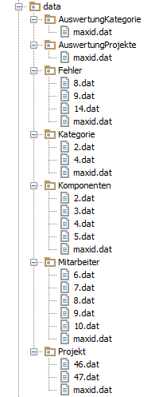
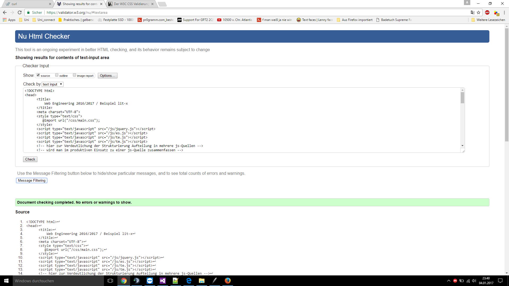
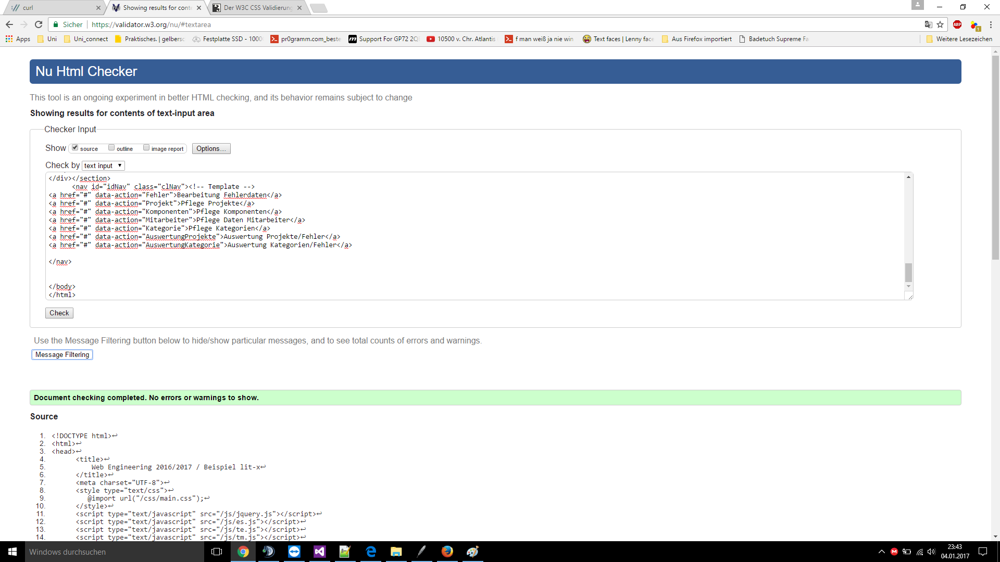
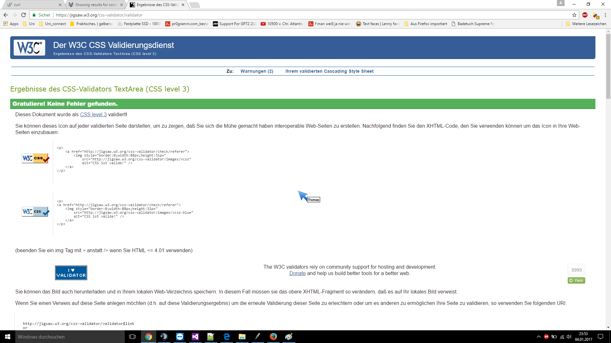

Praktikum 3, Termin 4, Webanwendung "Bug-Tracker"
===================

**Gruppe C**
>Thomas, Nowicki, 1043815
>Elbers, Lennart, 1005523
>Voß, Dustin, 969942

**05.01.2017**

----------

[TOC]

1. Einleitung
------------------
>"Bug-Tracker" sind ein Hilfsmittel bei der Qualitätssicherung von Software-Entwicklungsprojekten: erkannte Mängel werden proto-
> kolliert und weitere Bearbeitungsvorgänge zur Beseitigung der Mängel angestoßen.
> Durch hinterlegte Datensätze werden die Projekt, Fehler, Kategorien sowie Komponenten hinterlegt und durch spezielle Auswertungsseiten
> benutzerfreundlicher angezeigt. Es ist eine Singlepageapplikation, die tabellarisch Informationen anzeigt und dynamisch mit AJAX
> nachlädt

2. Implementierung des Servers
---------------------------------------------

------2.1 REST-Interface
---------------------------------
> **Anforderungen an den Server nach REST-Prinzip:**

> > Löst verschiedene Klassen nach Objekt-Dispatching auf und ruft die jeweiligen Funktion auf und gibt die Daten nach GET POST PUT DELETE auf.

------2.2 Module
----------------------
> **application.py**
> > **Aufgabe:**
> > >Beinhaltet alle Klassen für die Webanwendung. Mit Hilfe von REST werden bei bestimmten URI-Parameter die jeweiligen GET, POST, PUT - DELETE HTTP-Methoden ausgeführt.
> > >Datenhaltung, Importierung von Datenbanken, Anpassungen sowie falsch aufgerufene Anforderungen werden darin realisiert.
> 
> > **Klassen:**
> > >**Projekt_cl:**
> > > > **Aufgabe der Klasse:**
> > > > > Verwaltet Datenbestände aus den Projektdaten, innerhalb des Verzeichnisses "Projekt". Dient auch als ihre Schnittstelle.
> 
> > > > **Öffentliche Methoden:**
> > > > > **init(self):**
> > > > > > **Aufgabe:** Initialisiert das Datenbankobjekt für die Projektdaten
> 
> > > > > **GET(self, id):**
> > > > > > **Aufgabe:** Erhält die Daten aus den Projekt
> 
> > > > > **POST(self, data_opl):**
> > > > > > **Aufgabe:** Erstellt neue Daten für die Projekte
> 
> > > > > **PUT(self, data_opl):**
> > > > > > **Aufgabe:** Aktualisieren Daten für die Projekte
> 
> > > > > **DELETE(self, id):**
> > > > > > **Aufgabe:** Löscht Daten aus den Projekten
> 
> > >**Projektkomponente_cl:**
> > > > **Aufgabe der Klasse:**
> > > > > Hilfsklasse um die Datenbanken Projekte sowie Komponenten zu verbinden!
> 
> > > > **Öffentliche Methoden:**
> > > > > **init(self):**
> > > > > > **Aufgabe:** Erstellt Datenbankobjekte für Projekte sowie Komponenten
> 
> > > > > **GET(self, id):**
> > > > > > **Aufgabe:** Mit Hilfe der Projekt-ID werden alle Daten mit den in Kompentenen zugewiesenen Projekten ausgegeben.
> 
> > >**ProjektfehlerAuswertung_cl:**
> > > > **Aufgabe der Klasse:**
> > > > > Hilfsklasse um die Datenbanken Projekte, Fehler und Kompentenen zu verknüpfen
> 
> > > > **Öffentliche Methoden:**
> > > > > **init(self):**
> > > > > > **Aufgabe:** Erstellt Datenbankobjekte für Projekte, Fehler sowie Komponenten
> 
> > > > > **GET(self, id):**
> > > > > > **Aufgabe:** Zunächst wird nach dem Projektnamen innerhalb der Komponenten gesucht um damit die restlichen Fehlerdaten zu extrahieren
> 
> > >**ProjektKategorieAuswertung_cl:**
> > > > **Aufgabe der Klasse:**
> > > > > Hilfsklasse um die Datenbanken Fehler und Kategorie zu verknüpfen
> 
> > > > **Öffentliche Methoden:**
> > > > > **init(self):**
> > > > > > **Aufgabe:** Erstellt Datenbankobjekte für Fehler sowie Kategorie
> 
> > > > > **GET(self, id):**
> > > > > > **Aufgabe:** Filtert mit der übergebenen Kategorien-ID die Verwendeten innerhalb der Fehlerdatenbank
> 
> > >**Komponenten_cl:**
> > > > **Aufgabe der Klasse:**
> > > > > Verwaltet Datenbestände aus den Komponentendaten, innerhalb des Verzeichnisses "Komponenten". Dient auch als ihre Schnittstelle.
> 
> > > > **Öffentliche Methoden:**
> > > > > **init(self):**
> > > > > > **Aufgabe:** Initialisiert das Datenbankobjekt für die Komponentendaten
> 
> > > > > **GET(self, id):**
> > > > > > **Aufgabe:** Erhält die Daten aus den Komponenten
> 
> > > > > **POST(self, data_opl):**
> > > > > > **Aufgabe:** Erstellt neue Daten für die Komponenten
> 
> > > > > **PUT(self, data_opl):**
> > > > > > **Aufgabe:** Aktualisieren Daten für die Komponenten
> 
> > > > > **DELETE(self, id):**
> > > > > > **Aufgabe:** Löscht Daten aus den Komponenten
> 
> > >**Fehler_cl:**
> > > > **Aufgabe der Klasse:**
> > > > > Verwaltet Datenbestände aus den Fehlerdaten, innerhalb des Verzeichnisses "Fehler". Dient auch als ihre Schnittstelle.
> 
> > > > **Öffentliche Methoden:**
> > > > > **init(self):**
> > > > > > **Aufgabe:** Initialisiert das Datenbankobjekt für die Fehlerdaten
> 
> > > > > **GET(self, id):**
> > > > > > **Aufgabe:** Erhält die Daten aus den Fehler
> 
> > > > > **POST(self, data_opl):**
> > > > > > **Aufgabe:** Erstellt neue Daten für die Fehler
> 
> > > > > **PUT(self, data_opl):**
> > > > > > **Aufgabe:** Aktualisieren Daten für die Fehler
> 
> > > > > **DELETE(self, id):**
> > > > > > **Aufgabe:** Löscht Daten aus den Fehler
> 
> > >**Mitarbeiter_cl:**
> > > > **Aufgabe der Klasse:**
> > > > > Verwaltet Datenbestände aus den Mitarbeiterdaten, innerhalb des Verzeichnisses "Mitarbeiter". Dient auch als ihre Schnittstelle.
> 
> > > > **Öffentliche Methoden:**
> > > > > **init(self):**
> > > > > > **Aufgabe:** Initialisiert das Datenbankobjekt für die Mitarbeiterdaten
> 
> > > > > **GET(self, id):**
> > > > > > **Aufgabe:** Erhält die Daten aus den Mitarbeiter
> 
> > > > > **POST(self, data_opl):**
> > > > > > **Aufgabe:** Erstellt neue Daten für die Mitarbeiter
> 
> > > > > **PUT(self, data_opl):**
> > > > > > **Aufgabe:** Aktualisieren Daten für die Mitarbeiter
> 
> > > > > **DELETE(self, id):**
> > > > > > **Aufgabe:** Löscht Daten aus den Mitarbeiter
> 
> > >**Kategorie_cl:**
> > > > **Aufgabe der Klasse:**
> > > > > Verwaltet Datenbestände aus den Kategoriedaten, innerhalb des Verzeichnisses "Kategorie". Dient auch als ihre Schnittstelle.
> 
> > > > **Öffentliche Methoden:**
> > > > > **init(self):**
> > > > > > **Aufgabe:** Initialisiert das Datenbankobjekt für die Kategoriedaten
> 
> > > > > **GET(self, id):**
> > > > > > **Aufgabe:** Erhält die Daten aus den Kategorie
> 
> > > > > **POST(self, data_opl):**
> > > > > > **Aufgabe:** Erstellt neue Daten für die Kategorie
> 
> > > > > **PUT(self, data_opl):**
> > > > > > **Aufgabe:** Aktualisieren Daten für die Kategorie
> 
> > > > > **DELETE(self, id):**
> > > > > > **Aufgabe:** Löscht Daten aus den Kategorie
> 
> > >**Application_cl:**
> > > > **Aufgabe der Klasse:**
> > > > > Dient als Interface für die alle anderen Klassen, beinhaltet einen Handler, der den jeweiligen Klassen ihre URI's zuweist
> 
> > > > **Öffentliche Methoden:**
> > > > > **init(self):**
> > > > > > **Aufgabe:** Initialisierung des URI-Handlers
> 
> > > > > **GET(self, path_spl = 'Projekt', id=None):**
> > > > > > **Aufgabe:** Weiterleitung an entsprechende Klassenobjekt!
> 
> > > > > **POST(self, path_spl = 'Projekt', **data_opl):**
> > > > > > **Aufgabe:** Weiterleitung an entsprechende Klassenobjekt!
> 
> > > > > **PUT(self, path_spl = 'Projekt', **data_opl):**
> > > > > > **Aufgabe:** Weiterleitung an entsprechende Klassenobjekt!
> 
> > > > > **DELETE(self, path_spl = 'Projekt', id=None):**
> > > > > > **Aufgabe:** Weiterleitung an entsprechende Klassenobjekt!
> 
> > > > > **DELETE(self, path_spl = 'Projekt', id=None, **kwargs):**
> > > > > > **Aufgabe:** Weiterleitung der GET-Methode mit dem restlichen Keyvaluepaaren innerhalb der URI damit ?type-Anfrage realisiert werden kann
> 
> > > > > **default(self, *arguments, **kwargs):**
> > > > > > **Aufgabe:** Sollte eine falsche URI verwendet werden, gibts einen ERROR 404 der an den Client gesendet wird
> 
> **database.py:**
> > **Aufgabe:**
> > >Definiert das Datenbanksystem für unsere Anwendung.
> 
> > **Klassen:**
> > >**Database_cl:**
> > > > **Aufgabe der Klasse:**
> > > > > Oberklasse für alle anderen Datenbankklassen unserer Anwendung
> 
> > > > **Öffentliche Methoden:**
> > > > > **init(self, type_spl):**
> > > > > > **Aufgabe:** Initialisierung des bestehender Datensätzen und speichert die Datensätze in ihren Verzeichnissen ab. Legt ein lokales Dictionary data_o zusätzlich an, als Arbeitskopie
> 
> > > > > **create_px(self, data_opl):**
> > > > > > **Aufgabe:** Erstellt eine neue Datei für einen neuen Datensatz, ID wird mittels maxid.dat festgehalten.
> 
> > > > > **read_px(self, id_spl = None):**
> > > > > > **Aufgabe:** Ließt die Defaultwerte oder selektiert Werte, wenn ID übergeben wird
> 
> > > > > **update_px(self, id_spl, data_opl):**
> > > > > > **Aufgabe:** Selektiert Werte aus dem jeweiligen Datensatz mittels ID und manipuliert diese und legt sie wieder ab.
> 
> > > > > **delete_px(self, id_spl):**
> > > > > > **Aufgabe:** Löscht Datensatz
> 
> > > > > **getDefault_px(self):**
> > > > > > **Aufgabe:** Standardmethode wird mittels Vererbung angepasst
> 
> > > > > **readData_p(self):**
> > > > > > **Aufgabe:** Liefert alle Daten zurück
> 
> > > > > **nextId_p(self):**
> > > > > > **Aufgabe:** Ließt nächste ID aus der maxid.dat aus und erhöht dann um 1
> 
> > >**ProjektDatabase_cl(Database_cl):**
> > > > **Aufgabe der Klasse:**
> > > > > Konkrete Klasse für die Datensätze aus Projekt
> 
> > > > **Öffentliche Methoden:**
> > > > > **init(self):**
> > > > > > **Aufgabe:** Definiert konkrete Datenbank für Projekte erzeugen, Übergabe beinhaltet URI
> 
> > > > > **getDefault_px(self):**
> > > > > > **Aufgabe:** Definiert die Standardwerte für die Projekte innerhalb der neu angelegten Dateien.
> 
> > >**FehlerDatabase_cl(Database_cl):**
> > > > **Aufgabe der Klasse:**
> > > > > Konkrete Klasse für die Datensätze aus Fehler
> 
> > > > **Öffentliche Methoden:**
> > > > > **init(self):**
> > > > > > **Aufgabe:** Definiert konkrete Datenbank für Fehler erzeugen, Übergabe beinhaltet URI
> 
> > > > > **getDefault_px(self):**
> > > > > > **Aufgabe:** Definiert die Standardwerte für die Fehler innerhalb der neu angelegten Dateien.
> 
> > >**KomponenteDatabase_cl(Database_cl):**
> > > > **Aufgabe der Klasse:**
> > > > > Konkrete Klasse für die Datensätze aus Komponente
> 
> > > > **Öffentliche Methoden:**
> > > > > **init(self):**
> > > > > > **Aufgabe:** Definiert konkrete Datenbank für Komponenten erzeugen, Übergabe beinhaltet URI
> 
> > > > > **getDefault_px(self):**
> > > > > > **Aufgabe:** Definiert die Standardwerte für die Komponenten innerhalb der neu angelegten Dateien.
> 
> > >**MitarbeiterDatabase_cl(Database_cl):**
> > > > **Aufgabe der Klasse:**
> > > > > Konkrete Klasse für die Datensätze aus Mitarbeiter
> 
> > > > **Öffentliche Methoden:**
> > > > > **init(self):**
> > > > > > **Aufgabe:** Definiert konkrete Datenbank für Mitarbeiter erzeugen, Übergabe beinhaltet URI
> 
> > > > > **getDefault_px(self):**
> > > > > > **Aufgabe:** Definiert die Standardwerte für die Mitarbeiter innerhalb der neu angelegten Dateien.
> 
> > >**KategorieDatabase_cl(Database_cl):**
> > > > **Aufgabe der Klasse:**
> > > > > Konkrete Klasse für die Datensätze aus Kategorie
> 
> > > > **Öffentliche Methoden:**
> > > > > **init(self):**
> > > > > > **Aufgabe:** Definiert konkrete Datenbank für Kategorie erzeugen, Übergabe beinhaltet URI
> 
> > > > > **getDefault_px(self):**
> > > > > > **Aufgabe:** Definiert die Standardwerte für die Kategorie innerhalb der neu angelegten Dateien.
> 
> > >**AuswertungProjekteDatabase_cl(Database_cl):**
> > > > **Aufgabe der Klasse:**
> > > > > Konkrete Klasse für die Datensätze aus Auswertung
> 
> > > > **Öffentliche Methoden:**
> > > > > **init(self):**
> > > > > > **Aufgabe:** Definiert konkrete Datenbank für Auswertung erzeugen, Übergabe beinhaltet URI
> 
> > > > > **getDefault_px(self):**
> > > > > > **Aufgabe:** Definiert die Standardwerte für die Auswertung innerhalb der neu angelegten Dateien.
> 
> > >**AuswertungKategorieDatabase_cl(Database_cl):**
> > > > **Aufgabe der Klasse:**
> > > > > Konkrete Klasse für die Datensätze aus Auswertung
> 
> > > > **Öffentliche Methoden:**
> > > > > **init(self):**
> > > > > > **Aufgabe:** Definiert konkrete Datenbank für Auswertung erzeugen, Übergabe beinhaltet URI
> 
> > > > > **getDefault_px(self):**
> > > > > > **Aufgabe:** Definiert die Standardwerte für die Auswertung innerhalb der neu angelegten Dateien.
> 
> **navigation.py:**
> > **Aufgabe:**
> > >stellt Klasse Navigation_cl zur verfügung
> 
> > **Klassen:**
> > >**Navigation_cl(object):**
> > > > **Aufgabe der Klasse:**
> > > > > Lädt Einträge für Navigationsbar und legt gültige URI Adressen fest.
> 
> > > > **Öffentliche Methoden:**
> > > > > **init(self):**
> > > > > > **Aufgabe:** keine 
> 
> > > > > **GET(self):**
> > > > > > **Aufgabe:** liefert Datensatz gültiger URIs und der Texte für das Asside
> 
> **templates.py:**
> > **Aufgabe:**
> > >Stellt Klasse Templates_cl zur verfügung
> 
> > **Klassen:**
> > >**Templates_cl(object)::**
> > > > **Aufgabe der Klasse:**
> > > > > dynamisches sammeln von Daten fuer Templates durch übergebenen String der den Ordnerpfad der Templates enthält
> 
> > > > **Öffentliche Methoden:**
> > > > > **init(self):**
> > > > > > **Aufgabe:** keine
> 
> > > > > **GET(self):**
> > > > > > **Aufgabe:** Jeder Ordner in dem übergeben Pfad wird nach Templatedateien durchsucht die zurückgegeben werden
> 
> **Zusammenwirken der Module:**

> > Die Application_cl stellt Schnittstelle fuer Datenhaltung dar und liefert Daten fuer Templates. Sie dient auch als Schnittstelle für den Client

> > Templates_cl liefert alle Templates aus

> > Navigation_cl definiert die Navigation und die liefert die URI der Aufrufe an den Client

------2.3 Datenhaltung
------------------------------
> **Datenstrukturen und Speicherung in Dateien:**

> > 

3. Implementierung des Clients
--------------------------------------------

------3.1 Klassen
----------------------
> **app.js:**
> > **Application_cl:**
> > > **Aufgabe:**
> > > >Kreiert die URI und stellt den Verzeichnispfad sowie den Datebank identifiert sowie den ApplicationVerifier für die REST Methoden bereit
>
> **detail.js:**
> > **DetailView_cl:**
> > > **Aufgabe:**
> > > >Stellt PUT POST GET Methoden zur verfügung
> 
> > **SourceDetailView_cl:**
> > > **Aufgabe:**
> > > >Unterklasse von DetailView_cl überschreibt checkContent_p Methode
>
> **list.js:**
> > **ListView_cl:**
> > > **Aufgabe:**
> > > >definiert die Data-Aktionen die ausgeführt werden sollen. Stellt DELETE methode bereit. leichtes Benutzerhandling
>
> **nav.js:**
> > **Nav_cl:**
> > > **Aufgabe:**
> > > >Navigationsbereich wird zur Verfügung gestellt
>
> **es.js:**
> > **EventService_cl:**
> > > **Aufgabe:**
> > > >siehe 3.2
>
> **te.js:**
> > **Generator_cl:**
> > > **Aufgabe:**
> > > >erzeugt Templates
>
> > **TemplateCompiler_cl:**
> > > **Aufgabe:**
> > > >generiert Templates
> 
> **tm.js:**
> > **TemplateManager_cl:**
> > > **Aufgabe:**
> > > >verwaltet Templates
>
> **Zusammenwirken der Instanzen der Klassen:**
> 
> >Application_cl fuert alle Klassen über den EventService zusammen
> >ListView_cl und DetailView_cl verwenden die TemplateEngine um die Listen und Detail-Views zu generieren
> 

------3.2 Eventservice
-----------------------------

> **Einsatz des Eventservice:**
> >Siehe Aufgabenstellung oder unten

> > Subscriber melden sich fuer Nachrichten an. Mittels publish_px wird ein Nachricht in einen Nachrichtenbuffer mit Prioritätsabfrage gelegt
> > Die einzelnen Subscriber werden mittels der notify_px Schnittstelle informiert

------3.3 Templateverarbeitung
------------------------------------------

> **Verwendete Templates:**
> >- AuswertungKategorielist.tpl
> >- AuswertungKategorieTable.tpl
> >- AuswertungProjektelist.tpl
> >- AuswertungProjekteTable.tpl
> >- Fehlerdetail.tpl
> >- Fehlerlist.tpl
> >- Kategoriedetail.tpl
> >- Kategorielist.tpl
> >- Komponentendetail.tpl
> >- Komponentenlist.tpl
> >- Mitarbeiterdetail.tpl
> >- Mitarbeiterlist.tpl
> >- nav.tpl
> >- Projektdetail.tpl
> >- Projektkomponentelist.tpl
> >- Projektlist.tpl

4. Prüfung Markup und Stilregeln
-----------------------------------------------

> **Überprüfung des generierten Markups und der CSS-Stilregeln:**
> > Hier stehen Notizen zur Überprüfung des generierten Markups un der CSS-Stilregeln!
> > 
> > 
> > 
> > 
> > 
> >
> >

