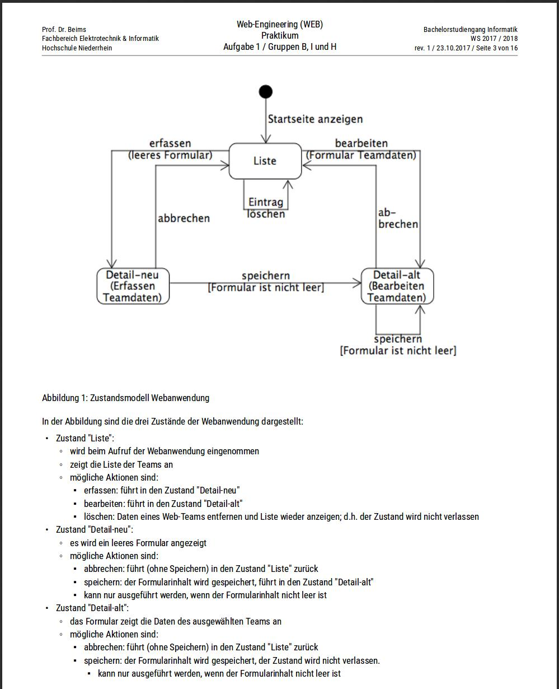
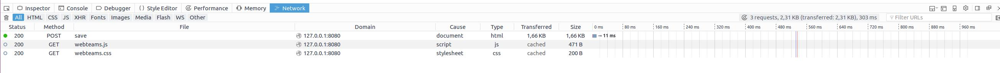

#Gruppeneinteilung#
Praktikumsgruppe - H
1. Johannes Möller 1008751
2. Christian Brouwers 960310

Stand: 22.11.2017

#Aufbau der Webanwedung#

#Durchgeführte Ergänzungen#

Änderungen
-------------

application.py
	Hinzufügen der Semesteranzahl
		Zeile 50
		Zeile 54
		
database.py
	Hinzufügen von Platzhalter für Semester
		Zeile 78
		Zeile 89
		
	Löschen-Funktion
		Zeile 71-73

view.py
	Hinzufügen von Semester in CreateList, sowie änderung der Arrayelemente
		Zeile 38
		Zeile 42
		
	Hinzufügen von Semester in CreateForm, sowie änderung der Arrayelemente
		Zeile 59
		Zeile 63	
		
form1.tpl
	Hinzufügen der Semesteranzahl
		Zeile 19-22
	
form2.tpl
	Hinzufügen Abbrechen-Button
		Zeile 4

list0.tpl
	Hinzufügen der Semesteranzahl
		Zeile 19
		Zeile 23
	
list1.tpl
	Hinzufügen der Semesteranzahl
		Zeile 7
		Zeile 11
		
webteams.css
	Alles
	
webteams.js
		Zeile 5 - 8 Abfrage löschen

#Beschreibung des HTTP-Datenverkehrs#
##beim Start der Anwendung##

##Beim speichern der Formular-Daten##

